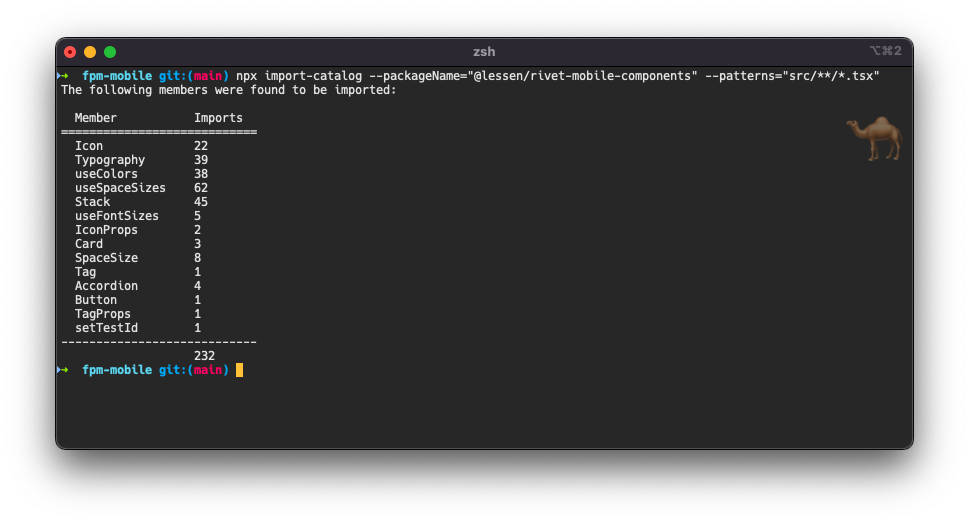

# import-catalog
> A simple CLI that easily lets you see an inventory of destructured imports from specific packages in your codebase.

Currently, the CLI only reports the number of times a member was imported from a module. It only detects import statements and also only registers exported members if using destructure syntax.



## Usage

Basic

```shell
$ npx import-catalog --packageName=@foo/bar --patterns="src/**/*.tsx"
```

For more information

```shell
$ npx import-catalog --help
```

## Todo
- [] Add support for non-destructured imports
- [] Add flags to reveal more data in catalog

